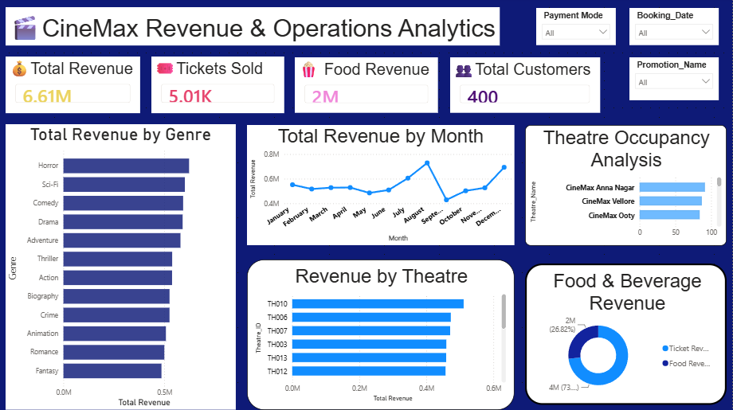

# 🍿 Movie Theatre Revenue & Operations Analytics

A specialized business intelligence and data analytics platform engineered to track, monitor, and optimize movie theater multiplex operations. This project provides deep operational insights into ticket distribution, audience turnout, snack counter profitability, and multi-screen screening schedules.

---



---

##  Project Architecture

The core data models, logic files, or analytical assets for this project are securely managed within the primary application package:

* **`Movie-Theatre-Revenue-Analytics/`:** The main repository workspace directory.
  * **`data/raw/`:** Staging home for original unedited Excel source tables.
  * **`data/cleaned/`:** Processed target tables transformed through Power Query pipelines.
  * **`powerbi/Movie_Theatre_Analytics.pbix`:** The primary interactive analytical reporting file.
  * **`documentation/`:** Houses the Business Requirement Document (BRD) and operational metadata mapping.

---

##  Core Analytical Metrics Covered

The system transforms raw cinema transaction strings into high-value corporate performance insights:

* **Box Office Performance:** Monitors revenue velocity, seating fill-rates, and ticket sales yield across different showtimes, weekends, and holidays.
* **Concession Stand Profitability:** Tracks food and beverage throughput, sales pairing trends (e.g., combo orders), and inventory margin analysis.
* **Screen Utilization Metrics:** Evaluates screen-by-screen throughput to optimize show frequencies based on movie genre popularity and runtime demands.
* **Customer Segment Demographics:** Breaks down sales volumes by ticket tiers (e.g., Premium, Standard, Lounges) and promotional channel performance.

---

##  Getting Started

Follow these operational guidelines to review and interact with the analytics models on your local machine.

###  Prerequisites

Depending on your project execution layer inside the workspace directory, make sure you have the following installed:

* **Microsoft Power BI Desktop** (Latest Version) to run the primary interactive report workspace.
* **Microsoft Excel** (2019 or newer) to view or audit the underlying dimension and fact staging tables.

###  Local Setup

1. **Clone the Repository:**
   ```bash
   git clone https://github.com
   cd Movie-Theatre-Revenue-Analytics
   ```

2. **Access Project Files:**
   Open the `powerbi` folder and launch `Movie_Theatre_Analytics.pbix` using Power BI Desktop.

3. **Re-link Data Source Files (If Needed):**
   If path exceptions break the source links upon initial file launch:
   * Select **Home** > **Transform Data** > **Data source settings** from the ribbon workspace.
   * Choose **Change Source** and redirect the target parameters to the local path of your spreadsheet files inside `data/raw/`.
   * Click **Apply Changes** to refresh the dataset.

---

##  License

This repository is open-source and free to adapt for personal, portfolio, or educational purposes.

